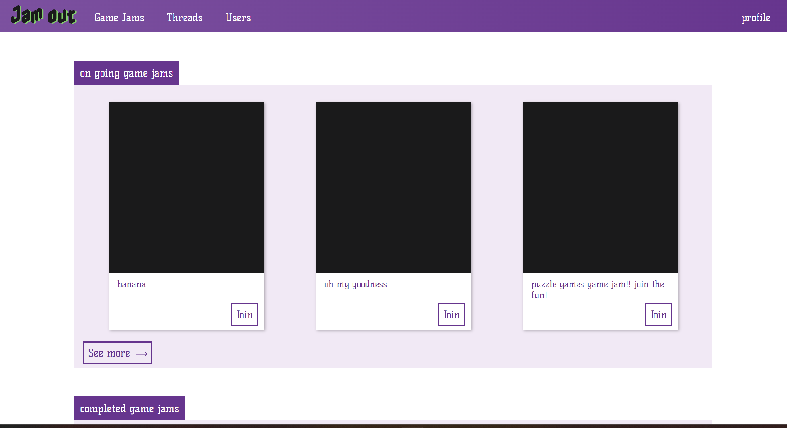

# Jam out
Jam out is a website dedicated to game creators, any person can open a game jam, assemble a team and create the game of their dreams. You can add the roles you need, accept or deny applications, apply to game jams, record your game making experience in dev logs, open threads to ask any question and comment your solution to any question you can answer.

please feel free to try it out for yourself [here](deployment/link)

## Technologies used:
- vscode -> coding
- git bash -> control
- github -> version control
- figma -> wireframe
- trello -> organization
- PSQL -> database
- django
- python -> coding language

## Future plans:
- All game jammers will be able to offer their completed games for download.
- Hosting can happen in the site instead of offsite
- more than one image can be uploaded instead of one per dev log or thread
- A search feature will be available
- A filtration system
- Access other user's profiles
- Each user will have their game jams, threads and links on their profile
- Users will be able to have links to their portfolio's and social media
- Users will also be able to have a bio and any roles that they assign for themselves
- Users will be able to favorite any gam jam, dev log or thread
- Users will be able to follow other users